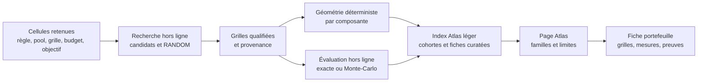

# Atlas des géométries de portefeuilles — architecture proposée

Date : 1er octobre 2026 · Auteur : AleaQuant · Statut : Atlas éditorial v0.1 ; outils personnalisés différés

## Objet et état réel

L'Atlas explique comment un ensemble de grilles occupe le domaine d'un jeu et
comment ses grilles se recouvrent. Une géométrie n'est ni une stratégie prédictive
ni, à elle seule, une probabilité de gain. Le dictionnaire scientifique et les
définitions déjà implémentées restent dans
[`atlas_metriques.md`](../../loto-keno-lab-generic/docs/atlas_metriques.md).

L'aperçu actuel assemble trois cohortes différentes dans `dist/data/atlas.json` :

| Jeu | Format montré | Taille | État de l'aperçu |
| --- | --- | ---: | --- |
| EuroMillions | 5/50 + 2 étoiles | 30 grilles | 35 contenus distincts montrés, avec évaluation exacte archivée. |
| Keno | 16/56, grilles de 10 numéros | 30 grilles | 11 portefeuilles curatés montrés ; les évaluations ne sont pas exposées dans le JSON du site. |
| Loto | 5/49 + Chance | 6 grilles | 5 portefeuilles **de démonstration**, sans évaluation exacte publiée. |

Il existe donc déjà une amorce Loto, mais pas encore un catalogue qualifié
comparable au travail EuroMillions ou Keno. L'interface commune masque aujourd'hui
ces différences de format, de taille et de degré de preuve.

## Contrat commun, cohortes séparées

Une fiche de portefeuille porte au minimum : `game_id`, `rule_id`, `format_id`,
taille et domaine de chaque composante, `grid_count`, mise unitaire et budget
si connus, famille principale et variante, graine et générateur, empreinte du
contenu canonique, version du calcul, provenance, statut de qualification et
méthode d'évaluation. Un champ inconnu est explicitement absent, jamais déduit
de la taille du portefeuille. Les alias désignent un même contenu, sans le
compter deux fois.

L'Atlas présente les mêmes **questions** pour chaque jeu :

1. Quelle part du domaine les grilles utilisent-elles (union, occurrences) ?
2. Combien de valeurs partagent deux grilles (distribution des intersections) ?
3. Combien de paires et de triplets distincts couvrent-elles, avec quelles
   répétitions ?
4. Que sait-on, séparément, d'un événement de gain défini sous la règle et le
   barème de cette cohorte ?

Les valeurs brutes gardent leurs dénominateurs. Des ratios descriptifs peuvent
faciliter la lecture, mais une « meilleure géométrie » universelle n'existe pas.
La composante secondaire est montrée **à part** : étoiles EuroMillions, Chance
Loto ; Keno n'en a pas. Les familles communes proposées sont `RANDOM`
(référence obligatoire), `BALANCED`, `LOW_OVERLAP`, `COVERAGE` et
`CONCENTRATED`. `CHANCE_SPREAD` et `STAR_BALANCED` sont des variantes de
composante secondaire ; `POOL*`, `TEMPORAL`, `HYBRID` et `MUTATION` restent des
méthodes ou sous-familles propres aux expériences. Les identifiants et familles
des catalogues sources sont conservés ; la traduction est une couche d'affichage
versionnée, pas une réécriture du laboratoire.

Une comparaison de résultats ne se fait **qu'à règle, format de grille, taille
de portefeuille, options, barème et budget identiques**, avec la référence
`RANDOM` et des graines reproductibles. Le nombre de grilles identique entre
jeux rend la géométrie lisible, mais ne rend ni les mises ni les gains
comparables. Un éventuel backtest historique s'arrête avant chaque tirage testé.
Les résultats exacts et Monte-Carlo sont étiquetés distinctement, avec
incertitude pour ces derniers.

## Politique de tailles et de calcul

### Acquis HPC à réutiliser

La [capitalisation HPC du laboratoire](../../loto-keno-lab/docs/CAPITALISATION-HPC-ATLAS.md)
est le point de départ des travaux de performance : Gosper/colex, revolving-door
Algorithm R, unranking Gray, B3 bitslicing/SWAR, SIMD NEON et réduction Metal.
Elle conserve les sources, preuves, benchmarks et résultats négatifs B1/B2.
Le débit historique de 8,7 G combinaisons/s concerne le matching de 30 grilles
sur des sous-espaces qualifiés ; il ne mesure ni une optimisation de portefeuille
ni le calcul des lois des features. La généralisation des tailles et des jeux
reste à qualifier. Réutiliser aussi le partitionnement colex et la persistance
du worker B3 avant de concevoir une nouvelle reprise de calcul.

**Deux opérations différentes** doivent être séparées : mesurer la géométrie
d'un portefeuille déjà choisi est rapide ; *chercher les grilles* qui couvrent
au mieux des sous-ensembles sous un budget et des contraintes est une
optimisation combinatoire. L'Atlas v0.1 présente des références qualifiées et
leurs limites ; il n'est pas un constructeur interactif de grilles.

Le catalogue peut **précalculer hors ligne des références pour quelques
cohortes choisies**, sans promettre de solution à chaque demande. Une cellule de
recherche fixe : jeu/règle, taille du pool `p`, taille des grilles `k`, nombre
de grilles `m` (ou budget et mise unitaire), composante secondaire, ordre de
couverture `t`, objectif, contraintes et version du protocole. Les tailles 6
et 30 sont les deux tailles *déjà montrées*, pas les seules prises en charge.
Le choix de tailles supplémentaires, dont éventuellement **m = 25**, suivra
l'intérêt pédagogique et le coût de qualification, sans matrice exhaustive.

Pour chaque cellule retenue : construire plusieurs candidats avec graines
fixes, conserver une référence `RANDOM` au même budget, mesurer la géométrie,
éventuellement chercher un meilleur candidat par recherche locale ou solveur,
puis archiver les grilles, le score, le temps de recherche, la provenance et
les bornes de qualité disponibles. « Optimisé » signifie *pour l'objectif
annoncé* ; « optimum » exige une preuve. Les objectifs de couverture des
paires, des triplets, d'équilibrage des occurrences et de faible recouvrement
peuvent être incompatibles : garder plusieurs solutions ou un front de
compromis, sans classement universel.

Les garanties conditionnelles `x if y of p` constituent un **axe de recherche
de l'Atlas**, décrit dans
[`garanties-conditionnelles-portefeuilles.md`](research/garanties-conditionnelles-portefeuilles.md).
Un premier cas Loto 10/5, `3 if 4`, a été résolu à **7 grilles minimum** avec
certificat du solveur et vérification exhaustive des 210 scénarios. Une fiche
de recherche peut présenter condition, taille minimale prouvée ou bornes,
grilles, méthode, temps et coût des mises. Le rang et le paiement éventuels
exigent encore Chance et un barème versionné. Les faibles rangs ne sont pas un
argument économique : la garantie conditionnelle doit être rapportée au coût
du portefeuille, sans promesse de rendement.

Pour Keno v1, partir du tirage **16/56** avec des grilles de **10 numéros**.
Les autres tailles de grilles et les anciens régimes sont des cohortes
distinctes, à ajouter selon l'intérêt éditorial et le barème. La sélection
du pool et la construction des grilles dans ce pool restent deux étapes
explicites dans toute étude ultérieure.

La géométrie d'un portefeuille **déjà disponible** peut être recalculée et
vérifiée. Elle ne certifie pas que le portefeuille est optimal. Si une cohorte
manque, l'Atlas v0.1 n'invente pas de solution et ne prend pas les 25 premières
grilles d'un portefeuille de 30 en les qualifiant d'optimales. Les
distributions exactes, Monte-Carlo et évaluations économiques restent hors
ligne et ciblées.

### Hors périmètre de l'Atlas v0.1

Il n'y aura pour cette version **ni commande de roues à la demande, ni file
de calcul public, ni réponse différée par courriel, ni vente de compute ou de
produits de garantie**. Le calcul de petites frontières conditionnelles reste
une recherche hors ligne, indépendante de toute offre personnalisée.
L'Atlas doit d'abord montrer des portefeuilles de référence compréhensibles,
leurs mesures et leurs limites, notamment pour le Loto.

## Données et parcours de publication

Le laboratoire reste la source des grilles et des résultats de recherche ; le
site vérifie les empreintes et publie une projection explicite. À terme,
séparer un index léger des fiches détaillées plutôt que grossir sans limite
`atlas.json`. Une fiche indique son niveau : démonstration géométrique,
évaluation exploratoire ou résultat exact qualifié. L'article de fond précède
l'outil : union, recouvrement, couverture et distinction entre la probabilité
d'une grille et celle d'un événement concernant **plusieurs** grilles.

## Travaux de la première itération

1. Versionner le schéma de cohorte et l'adaptateur d'affichage des familles ;
   montrer jeu, règle, format, taille, budget connu et niveau de preuve partout.
2. Qualifier quelques portefeuilles Loto représentatifs : les cinq
   démonstrations actuelles sont le point de départ, pas des résultats classés.
   Montrer `RANDOM` et des familles de géométrie sous un protocole et un budget
   communs ; retenir les tailles qui rendent la comparaison pédagogique.
   Conserver `CHANCE_SPREAD` comme variante de la composante Chance, avec
   grilles, graines, empreintes et limites archivées.
3. Ajouter les cohortes pédagogiques à 6 grilles EuroMillions et Keno 10-numéros,
   en gardant leurs 30-grilles archivées. Comparer géométries uniquement à
   l'intérieur d'une cohorte tant que les protocoles d'évaluation divergent.
4. Choisir un événement et une évaluation Loto pertinents, à budget identique
   et contre `RANDOM`, avant de publier un classement de résultats. Les cinq
   démonstrations actuelles ne constituent pas ce classement.
5. Produire une fiche et un article d'introduction, tester la compréhension des
   libellés et mesurer le poids de l'index avant d'envisager d'autres tailles.

Critère de sortie : chaque nombre affiché renvoie à sa définition, à sa cohorte
et à sa provenance ; aucune comparaison de gains ne traverse deux cohortes ;
une taille non précalculée ne fait pas échouer l'Atlas et n'est pas annoncée
comme évaluée. Comprendre le hasard n'est pas prédire le prochain tirage.
