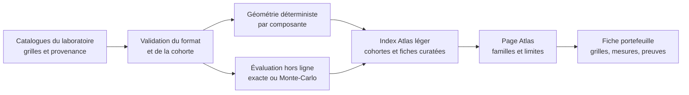

# Atlas des géométries de portefeuilles — architecture proposée

Date : 1er octobre 2026 · Auteur : AleaQuant · Statut : décision de conception, calculs Loto à qualifier

## Objet et état réel

L'Atlas explique comment un ensemble de grilles occupe le domaine d'un jeu et
comment ses grilles se recouvrent. Une géométrie n'est ni une stratégie prédictive
ni, à elle seule, une probabilité de gain. Le dictionnaire scientifique et les
définitions déjà implémentées restent dans
[`atlas_metriques.md`](../../loto-keno-lab-generic/docs/atlas_metriques.md).

L'aperçu actuel assemble trois cohortes différentes dans `dist/data/atlas.json` :

| Jeu | Format montré | Taille | État de l'aperçu |
| --- | --- | ---: | --- |
| EuroMillions | 5/50 + 2 étoiles | 30 grilles | 35 contenus distincts montrés, avec évaluation exacte archivée. |
| Keno | 16/56, grilles de 10 numéros | 30 grilles | 11 portefeuilles curatés montrés ; les évaluations ne sont pas exposées dans le JSON du site. |
| Loto | 5/49 + Chance | 6 grilles | 5 portefeuilles **de démonstration**, sans évaluation exacte publiée. |

Il existe donc déjà une amorce Loto, mais pas encore un catalogue qualifié
comparable au travail EuroMillions ou Keno. L'interface commune masque aujourd'hui
ces différences de format, de taille et de degré de preuve.

## Contrat commun, cohortes séparées

Une fiche de portefeuille porte au minimum : `game_id`, `rule_id`, `format_id`,
taille et domaine de chaque composante, `grid_count`, mise unitaire et budget
si connus, famille principale et variante, graine et générateur, empreinte du
contenu canonique, version du calcul, provenance, statut de qualification et
méthode d'évaluation. Un champ inconnu est explicitement absent, jamais déduit
de la taille du portefeuille. Les alias désignent un même contenu, sans le
compter deux fois.

L'Atlas présente les mêmes **questions** pour chaque jeu :

1. Quelle part du domaine les grilles utilisent-elles (union, occurrences) ?
2. Combien de valeurs partagent deux grilles (distribution des intersections) ?
3. Combien de paires et de triplets distincts couvrent-elles, avec quelles
   répétitions ?
4. Que sait-on, séparément, d'un événement de gain défini sous la règle et le
   barème de cette cohorte ?

Les valeurs brutes gardent leurs dénominateurs. Des ratios descriptifs peuvent
faciliter la lecture, mais une « meilleure géométrie » universelle n'existe pas.
La composante secondaire est montrée **à part** : étoiles EuroMillions, Chance
Loto ; Keno n'en a pas. Les familles communes proposées sont `RANDOM`
(référence obligatoire), `BALANCED`, `LOW_OVERLAP`, `COVERAGE` et
`CONCENTRATED`. `CHANCE_SPREAD` et `STAR_BALANCED` sont des variantes de
composante secondaire ; `POOL*`, `TEMPORAL`, `HYBRID` et `MUTATION` restent des
méthodes ou sous-familles propres aux expériences. Les identifiants et familles
des catalogues sources sont conservés ; la traduction est une couche d'affichage
versionnée, pas une réécriture du laboratoire.

Une comparaison de résultats ne se fait **qu'à règle, format de grille, taille
de portefeuille, options, barème et budget identiques**, avec la référence
`RANDOM` et des graines reproductibles. Le nombre de grilles identique entre
jeux rend la géométrie lisible, mais ne rend ni les mises ni les gains
comparables. Un éventuel backtest historique s'arrête avant chaque tirage testé.
Les résultats exacts et Monte-Carlo sont étiquetés distinctement, avec
incertitude pour ces derniers.

## Politique de tailles et de calcul

**Ne pas précalculer le produit de toutes les tailles, familles, règles et
options.** Pour le premier Atlas, retenir deux tailles repères : **6 et 30
grilles**. Elles correspondent aux deux formats déjà présents : 6 pour la
démonstration Loto ; 30 pour les études EuroMillions et Keno. Compléter ensuite
les cohortes manquantes (6 EuroMillions/Keno, 30 Loto) avec un protocole et une
référence `RANDOM` identiques à l'intérieur de chaque cohorte. Ce sont des
repères éditoriaux, pas des tailles optimales. Une grille seule peut servir
d'exemple pédagogique, mais ses intersections entre grilles sont indéfinies.

Pour Keno v1, figer **10 numéros par grille, tirage 16/56** à ces deux tailles.
Les formats de 4 à 9 numéros sont des cohortes distinctes à ouvrir lorsqu'une
question éditoriale et son barème justifient le calcul ; ne pas les multiplier
automatiquement par les deux tailles repères. Les anciens régimes Keno restent
séparés. Les nouvelles tailles peuvent être demandées ponctuellement, sans
supposer que les seuils ou conclusions du 10-numéros se transportent.

Le catalogue curaté et sa **géométrie déterministe** sont précalculés pour les
cohortes publiées. Pour une taille libre, la géométrie peut être calculée à la
demande à partir de grilles validées, puis mise en cache par empreinte du
portefeuille + règle + version du calcul, avec une limite de ressources. Les
distributions exactes, Monte-Carlo et évaluations économiques restent des
travaux hors ligne sur un sous-ensemble justifié ; elles ne sont pas lancées par
une visite de page. Un calcul non fait s'affiche « non évalué », pas comme zéro.

### Exemple concret : demander 20 grilles

L'utilisateur choisit **jeu et règle**, format de grille (pour Keno, par exemple
10 numéros), `20` grilles, famille et éventuellement graine ; il peut aussi
fournir ses 20 grilles. Le moteur génère ou lit **les 20 grilles elles-mêmes** :
il ne coupe pas un portefeuille de 30, car cette coupe changerait sa géométrie
et le sens de sa méthode de construction. Il valide valeurs, composantes,
nombre de grilles et options, puis calcule union, occurrences, intersections
des 190 couples de grilles, couverture des paires et triplets, et les mesures
propres à la composante secondaire. Un portefeuille de référence `RANDOM` de
20 grilles peut être construit sous les mêmes contraintes et au même budget.

La réponse immédiate est une **fiche de géométrie descriptive** avec règles,
grilles, graine, version et empreinte. Elle ne reçoit ni badge « rare » sans
distribution de référence à 20 grilles, ni probabilité de gain, ni classement
économique improvisé. Une évaluation de résultats peut être demandée comme
travail séparé, avec son événement, son barème, sa méthode et son statut.

Le site actuel publie des fichiers statiques : cette demande publique
interactive **n'existe pas encore**. Première réalisation possible : une
commande locale dans le moteur Python, produisant la fiche reproductible ;
ensuite une interface et un petit service de calcul pour la géométrie seule.
Le service devra être vérifié contre les mêmes cas de référence que le moteur
Python. Son cache pourra indexer le contenu canonique, le jeu, la règle et la
version du calcul ; l'identité de la famille et la graine restent dans la
provenance. Ni le Worker ni le navigateur ne déclencheront d'énumération
exhaustive pour répondre à cette demande.

## Données et parcours de publication

Le laboratoire reste la source des grilles et des résultats de recherche ; le
site vérifie les empreintes et publie une projection explicite. À terme,
séparer un index léger des fiches détaillées plutôt que grossir sans limite
`atlas.json`. Une fiche indique son niveau : démonstration géométrique,
évaluation exploratoire ou résultat exact qualifié. L'article de fond précède
l'outil : union, recouvrement, couverture et distinction entre la probabilité
d'une grille et celle d'un événement concernant **plusieurs** grilles.

## Travaux de la première itération

1. Versionner le schéma de cohorte et l'adaptateur d'affichage des familles ;
   montrer jeu, règle, format, taille, budget connu et niveau de preuve partout.
2. Qualifier un générateur Loto à 6 **et** 30 grilles avec variantes `RANDOM`,
   équilibrée, faible recouvrement, couverture et concentration ; conserver
   `CHANCE_SPREAD` comme expérience sur la composante Chance. Valider grilles,
   empreintes, graines, métriques et absence de doublons avant publication.
3. Ajouter les cohortes pédagogiques à 6 grilles EuroMillions et Keno 10-numéros,
   en gardant leurs 30-grilles archivées. Comparer géométries uniquement à
   l'intérieur d'une cohorte tant que les protocoles d'évaluation divergent.
4. Choisir un événement et une évaluation Loto pertinents, à budget identique
   et contre `RANDOM`, avant de publier un classement de résultats. Les cinq
   démonstrations actuelles ne constituent pas ce classement.
5. Produire une fiche et un article d'introduction, tester la compréhension des
   libellés et mesurer le poids de l'index avant toute extension des tailles.

Critère de sortie : chaque nombre affiché renvoie à sa définition, à sa cohorte
et à sa provenance ; aucune comparaison de gains ne traverse deux cohortes ;
une taille non précalculée ne fait pas échouer l'Atlas et n'est pas annoncée
comme évaluée. Comprendre le hasard n'est pas prédire le prochain tirage.
