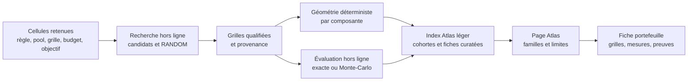

# Atlas des géométries de portefeuilles — architecture proposée

Date : 1er octobre 2026 · Auteur : AleaQuant · Statut : décision de conception, calculs Loto à qualifier

## Objet et état réel

L'Atlas explique comment un ensemble de grilles occupe le domaine d'un jeu et
comment ses grilles se recouvrent. Une géométrie n'est ni une stratégie prédictive
ni, à elle seule, une probabilité de gain. Le dictionnaire scientifique et les
définitions déjà implémentées restent dans
[`atlas_metriques.md`](../../loto-keno-lab-generic/docs/atlas_metriques.md).

L'aperçu actuel assemble trois cohortes différentes dans `dist/data/atlas.json` :

| Jeu | Format montré | Taille | État de l'aperçu |
| --- | --- | ---: | --- |
| EuroMillions | 5/50 + 2 étoiles | 30 grilles | 35 contenus distincts montrés, avec évaluation exacte archivée. |
| Keno | 16/56, grilles de 10 numéros | 30 grilles | 11 portefeuilles curatés montrés ; les évaluations ne sont pas exposées dans le JSON du site. |
| Loto | 5/49 + Chance | 6 grilles | 5 portefeuilles **de démonstration**, sans évaluation exacte publiée. |

Il existe donc déjà une amorce Loto, mais pas encore un catalogue qualifié
comparable au travail EuroMillions ou Keno. L'interface commune masque aujourd'hui
ces différences de format, de taille et de degré de preuve.

## Contrat commun, cohortes séparées

Une fiche de portefeuille porte au minimum : `game_id`, `rule_id`, `format_id`,
taille et domaine de chaque composante, `grid_count`, mise unitaire et budget
si connus, famille principale et variante, graine et générateur, empreinte du
contenu canonique, version du calcul, provenance, statut de qualification et
méthode d'évaluation. Un champ inconnu est explicitement absent, jamais déduit
de la taille du portefeuille. Les alias désignent un même contenu, sans le
compter deux fois.

L'Atlas présente les mêmes **questions** pour chaque jeu :

1. Quelle part du domaine les grilles utilisent-elles (union, occurrences) ?
2. Combien de valeurs partagent deux grilles (distribution des intersections) ?
3. Combien de paires et de triplets distincts couvrent-elles, avec quelles
   répétitions ?
4. Que sait-on, séparément, d'un événement de gain défini sous la règle et le
   barème de cette cohorte ?

Les valeurs brutes gardent leurs dénominateurs. Des ratios descriptifs peuvent
faciliter la lecture, mais une « meilleure géométrie » universelle n'existe pas.
La composante secondaire est montrée **à part** : étoiles EuroMillions, Chance
Loto ; Keno n'en a pas. Les familles communes proposées sont `RANDOM`
(référence obligatoire), `BALANCED`, `LOW_OVERLAP`, `COVERAGE` et
`CONCENTRATED`. `CHANCE_SPREAD` et `STAR_BALANCED` sont des variantes de
composante secondaire ; `POOL*`, `TEMPORAL`, `HYBRID` et `MUTATION` restent des
méthodes ou sous-familles propres aux expériences. Les identifiants et familles
des catalogues sources sont conservés ; la traduction est une couche d'affichage
versionnée, pas une réécriture du laboratoire.

Une comparaison de résultats ne se fait **qu'à règle, format de grille, taille
de portefeuille, options, barème et budget identiques**, avec la référence
`RANDOM` et des graines reproductibles. Le nombre de grilles identique entre
jeux rend la géométrie lisible, mais ne rend ni les mises ni les gains
comparables. Un éventuel backtest historique s'arrête avant chaque tirage testé.
Les résultats exacts et Monte-Carlo sont étiquetés distinctement, avec
incertitude pour ces derniers.

## Politique de tailles et de calcul

**Deux opérations différentes** doivent être séparées : mesurer la couverture
d'un portefeuille déjà choisi est rapide ; *chercher les grilles* qui couvrent
au mieux des sous-ensembles sous un budget et des contraintes est une
optimisation combinatoire. La précédente formulation « géométrie à la demande »
ne décrivait que la première opération. Elle ne suffit pas pour fabriquer un
portefeuille qualifié à une nouvelle taille.

Le catalogue doit donc **précalculer hors ligne des solutions pour une matrice
de paramètres utiles**, et non seulement pour 6 et 30 grilles. Une cellule de
recherche fixe : jeu/règle, taille du pool `p`, taille des grilles `k`, nombre
de grilles `m` (ou budget et mise unitaire), composante secondaire, ordre de
couverture `t`, objectif, contraintes et version du protocole. Les tailles 6
et 30 sont les deux tailles *déjà montrées*, pas les seules prises en charge.
Le premier plan de qualification Loto doit comprendre notamment **m = 25** ;
les autres tailles prioritaires seront choisies avec une grille explicite de
coût et d'intérêt éditorial, plutôt qu'un produit cartésien aveugle.

Pour chaque cellule retenue : construire plusieurs candidats avec graines
fixes, conserver une référence `RANDOM` au même budget, mesurer la géométrie,
éventuellement chercher un meilleur candidat par recherche locale ou solveur,
puis archiver les grilles, le score, le temps de recherche, la provenance et
les bornes de qualité disponibles. « Optimisé » signifie *pour l'objectif
annoncé* ; « optimum » exige une preuve. Les objectifs de couverture des
paires, des triplets, d'équilibrage des occurrences et de faible recouvrement
peuvent être incompatibles : garder plusieurs solutions ou un front de
compromis, sans classement universel.

Les numéros concrets d'un pool n'obligent généralement pas à refaire la
recherche **géométrique** : sous une règle symétrique, un modèle optimisé sur
`{1,…,p}` peut être renommé bijectivement avec les `p` numéros choisis. Sa
couverture et ses intersections sont identiques. Ce raccourci ne vaut pas pour
des contraintes liées à la valeur ou à l'histoire des numéros (décades,
distance numérique, observations passées) ; ces objectifs exigent une cellule
et une validation distinctes. La sélection du pool et l'optimisation des
grilles dans ce pool restent deux étapes explicites.

Pour Keno v1, partir du tirage **16/56** avec des grilles de **10 numéros**.
Les autres tailles de grilles et les anciens régimes sont des cohortes
distinctes, à ajouter selon demande et barème. Un pool de 10 numéros avec des
grilles Keno de 10 numéros ne produit qu'une grille distincte : l'exemple
« pool de 10, budget de 25 grilles » concerne donc plutôt des grilles plus
petites, comme les 5 numéros principaux du Loto.

La géométrie d'un portefeuille **fourni** peut toujours être recalculée à la
demande et mise en cache. Elle ne certifie pas que le portefeuille est bien
construit. Si une cellule d'optimisation manque, l'Atlas affiche « solution non
calculée » et peut l'inscrire dans une file de recherche hors ligne ; il ne
prend pas les 25 premières grilles d'un portefeuille de 30 en les qualifiant
d'optimales. Une famille *emboîtée* optimisée pour ses préfixes serait une
méthode explicite distincte. Les distributions exactes, Monte-Carlo et
évaluations économiques restent également hors ligne et ciblées.

### Exemple concret : pool Loto de 10 numéros, 25 grilles

Le pool contient 10 numéros ; chaque grille principale en choisit 5. Il existe
`C(10,5) = 252` grilles principales candidates. L'objectif pourrait être de
couvrir autant que possible les `C(10,3) = 120` triplets du pool avec 25
grilles, sous des contraintes de recouvrement et avec une politique explicite
pour le numéro Chance. **Mesurer** les 25 grilles est simple ; sélectionner
les 25 parmi 252 pour cet objectif est la recherche à précalculer. Il faut
archiver aussi une solution `RANDOM` de 25 grilles et, si possible, une borne
ou un certificat pour évaluer la qualité de la solution trouvée. Aucune
couverture géométrique n'implique à elle seule un gain supérieur.

Le site actuel publie des fichiers statiques et n'exécute pas cette recherche.
L'interface devra d'abord chercher une cellule qualifiée dans le catalogue ;
si elle existe, elle renomme le modèle canonique selon le pool demandé et
affiche les grilles et leur provenance. Si elle manque, elle indique son statut
ou propose seulement l'analyse descriptive de grilles apportées par le lecteur.
Ni le Worker ni le navigateur ne lancent une optimisation lourde ou une
énumération exhaustive lors de la consultation.

## Données et parcours de publication

Le laboratoire reste la source des grilles et des résultats de recherche ; le
site vérifie les empreintes et publie une projection explicite. À terme,
séparer un index léger des fiches détaillées plutôt que grossir sans limite
`atlas.json`. Une fiche indique son niveau : démonstration géométrique,
évaluation exploratoire ou résultat exact qualifié. L'article de fond précède
l'outil : union, recouvrement, couverture et distinction entre la probabilité
d'une grille et celle d'un événement concernant **plusieurs** grilles.

## Travaux de la première itération

1. Versionner le schéma de cohorte et l'adaptateur d'affichage des familles ;
   montrer jeu, règle, format, taille, budget connu et niveau de preuve partout.
2. Définir la première matrice Loto `(pool p, grille k=5, budget m, objectif t)` ;
   inclure le cas **p=10, m=25** et les tailles 6 et 30 déjà visibles. Qualifier
   pour chaque cellule retenue une référence `RANDOM` et plusieurs familles
   (équilibrée, faible recouvrement, couverture, concentration). Conserver
   `CHANCE_SPREAD` comme expérience sur la composante Chance. Archiver grilles,
   empreintes, graines, score, bornes disponibles et durée de recherche.
3. Ajouter les cohortes pédagogiques à 6 grilles EuroMillions et Keno 10-numéros,
   en gardant leurs 30-grilles archivées. Comparer géométries uniquement à
   l'intérieur d'une cohorte tant que les protocoles d'évaluation divergent.
4. Choisir un événement et une évaluation Loto pertinents, à budget identique
   et contre `RANDOM`, avant de publier un classement de résultats. Les cinq
   démonstrations actuelles ne constituent pas ce classement.
5. Produire une fiche et un article d'introduction, tester la compréhension des
   libellés et mesurer le poids de l'index avant d'étendre la matrice des
   tailles, pools et objectifs.

Critère de sortie : chaque nombre affiché renvoie à sa définition, à sa cohorte
et à sa provenance ; aucune comparaison de gains ne traverse deux cohortes ;
une taille non précalculée ne fait pas échouer l'Atlas et n'est pas annoncée
comme évaluée. Comprendre le hasard n'est pas prédire le prochain tirage.
