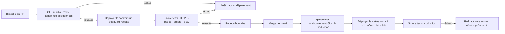

# Politique CI, recette et production AleaQuant

**Version :** 0.1 · **Date :** 2026-10-01 · **Auteur :** AleaQuant  
**Statut :** proposition d’architecture ; aucun pipeline CI ni environnement de recette n’est configuré par ce document.

## Décision proposée

Utiliser deux Workers persistants Wrangler : `aleaquant-recette` pour la recette
et le Worker actuel `aleaquant` pour la production. La recette sert sur
`recette.aleaquant.org`, protégé par Cloudflare Access ; la production sert sur
`aleaquant.org`. Garder `workers.dev` comme adresse technique de secours pendant
la transition. Le sous-domaine `private.aleaquant.org` reste réservé au tunnel
d’accès au Mac et ne doit pas être réutilisé pour la recette.

Les aperçus Cloudflare par branche sont une évolution possible quand la CI est
en place. Ils créent un déploiement distinct par branche avec URL stable et URL
immuable par déploiement, variables et observabilité isolées. Ils sont publics
par défaut ; un aperçu sur domaine personnalisé doit être protégé par Access.
Pour le POC éditorial actuel, un seul environnement de recette permanent est
plus simple à exploiter.

## Modèle Cloudflare

Wrangler permet des environnements nommés persistants, par exemple
`--env staging`; un environnement déploie un Worker distinct, généralement
`aleaquant-staging`. Les bindings, `vars`, routes et domaines doivent être
déclarés explicitement dans chaque environnement : ils ne sont pas hérités.
Cloudflare provisionne un certificat pour chaque environnement publié ; les
noms d’environnement ne doivent donc pas contenir d’information secrète.

Les Previews Cloudflare sont destinés aux branches et pull requests ; les
environnements Wrangler conviennent mieux à une recette permanente. Les Version
URLs permettent de contrôler une version téléversée avant de la déployer. Une
version capture code, assets, bindings et compatibilité, mais pas l’état modifié
des bases et stockages associés. Aujourd’hui le site est principalement
statique et le déploiement envoie `dist/` ; la séparation des données devra être
réexaminée si un service avec état est ajouté.

## Flux de livraison

## Règles CI et publication

1. Toute modification passe par une branche ou une PR et des contrôles locaux/CI.
   Aucun `wrangler deploy` lancé depuis un poste n’est requis pour le flux normal.
2. La CI enregistre le SHA Git, les versions d’outils et le manifeste des assets
   (`dist/`) dans les journaux de livraison. Données générées, rapports et
   secrets ne sont pas embarqués par défaut.
3. Un déploiement sur recette ne modifie jamais le Worker de production. La
   recette est protégée par Cloudflare Access et marquée `noindex` ; vérifier
   que le Worker ne divulgue pas de brouillons ou de données non destinés au
   public avant d’y envoyer l’intégralité de `dist/`.
4. La recette humaine porte sur un SHA précis. Si le commit change, la validation
   expire et la recette doit être rejouée.
5. Le passage en production exige une approbation explicite de l’environnement
   GitHub `production`. Déployer le même SHA et les mêmes assets que ceux validés
   en recette ; reconstruire à partir d’entrées non figées invalide cette
   équivalence.
6. Après déploiement, vérifier HTTP 200, HTTPS, pages représentatives des jeux,
   histogrammes et fichiers statiques, puis consigner version Worker, SHA,
   résultat et heure dans `docs/DEPLOYMENTS.md`.
7. En cas d’échec fonctionnel, restaurer le déploiement Worker précédent avec
   Wrangler ou le tableau de bord. Le rollback de code n’annule pas des changements
   d’état dans D1/R2/KV : les futures migrations de données auront une procédure
   dédiée.
8. Les secrets CI restent dans les secrets d’environnement GitHub/Cloudflare ;
   ne jamais les committer ni les inclure dans les logs. Les identifiants de
   production ne sont accessibles qu’au job production.

## Validation éditoriale et recette technique

Ces validations sont distinctes. La recette technique vérifie que le site,
les routes et les assets fonctionnent. L’approbation éditoriale vérifie le
contenu : l’article garde son approbation liée au SHA-256 exact du brouillon.
Une CI verte ne vaut pas approbation éditoriale et une approbation d’article ne
vaut pas validation du déploiement.

## Clés et identités de service

Ne pas réutiliser le jeton du tunnel `cloudflared` comme clé de déploiement ni
comme authentification de l’interface de recette. Ce jeton autorise uniquement
le connecteur installé sur le Mac à établir le tunnel Cloudflare ; il n’est pas
une clé privée SSH et n’accorde pas, à lui seul, l’accès à l’application.

| Usage | Identité recommandée | Stockage et portée |
|---|---|---|
| Connexion humaine à la recette | Identité interactive derrière Cloudflare Access (Google ou code e-mail) | Politique Access limitée au propriétaire ; MFA si disponible |
| Déploiement CI vers Workers | API Token Cloudflare dédié au projet avec droit Workers Scripts Edit, limité au compte requis | Secret de l’environnement GitHub `production`; clé distincte pour recette si nécessaire |
| Tunnel vers le Mac | Jeton propre au tunnel Cloudflare | Conservé seulement sur le Mac, fichier LaunchAgent lisible par son compte ; rotation en cas d’exposition |
| Approbation de mise en production | Approbateur de l’environnement protégé GitHub | Approbation associée au SHA validé |

Si « clé privée de service » désigne un Service Token Cloudflare Access, celui-ci
sert à l’authentification machine-à-machine vers une application protégée. Il ne
remplace ni le jeton du tunnel, ni l’API Token de déploiement, ni la connexion
interactive requise pour la revue humaine. Pour la recette consultée par Chris,
préférer une politique Access avec identité personnelle plutôt que de distribuer
un Service Token au navigateur.

## Mise en place par étapes

1. Créer l’application Cloudflare Access de `recette.aleaquant.org` et son
   Worker `aleaquant-recette` sans modifier la production.
2. Ajouter un environnement `staging` à `wrangler.jsonc`, avec un nom, un domaine
   personnalisé et chaque binding explicitement déclaré. Vérifier que les
   secrets/données copiés sont adaptés à la recette.
3. Créer une CI GitHub qui exécute les contrôles déjà disponibles et déploie
   recette seulement après succès. Configurer `production` comme environnement
   protégé avec approbation humaine.
4. Tester une livraison de bout en bout et le rollback avant de désactiver le
   déploiement manuel historique.
5. Ajouter ensuite, si utile, des Workers Previews par PR, avec nettoyage des
   previews fermées et Access si elles utilisent un domaine personnalisé.

## État actuel et prérequis

- Production : Worker `aleaquant`, domaine personnalisé `aleaquant.org`,
  `workers.dev` activé.
- Recette : la maquette éditoriale est actuellement une page `/maquette/` dans
  le Worker de production ; ce n’est pas un environnement isolé.
- Aucun workflow GitHub Actions de livraison n’a été trouvé dans le dépôt au
  moment de cette proposition.
- Avant activation CI : rétablir l’accès GitHub du poste, vérifier que la branche
  distante contient les commits locaux à livrer, et choisir les contrôles
  déterministes obligatoires. Ne pas lancer un push forcé pour contourner l’écart.
- La version installée de Wrangler est 4.145.0 ; Cloudflare Previews nécessite
  actuellement Wrangler 4.135.0 ou plus. Le projet ne dispose pas encore d’une
  dépendance Wrangler locale figée ; épingler sa version CI avant automatisation.

## Références officielles

- [Environnements Wrangler](https://developers.cloudflare.com/workers/wrangler/environments/)
- [Configuration Wrangler](https://developers.cloudflare.com/workers/wrangler/configuration/)
- [Cloudflare Workers Previews](https://developers.cloudflare.com/workers/previews/)
- [Version URLs](https://developers.cloudflare.com/workers/versions-and-deployments/version-urls/)
- [Versions et déploiements](https://developers.cloudflare.com/workers/versions-and-deployments/)
- [Custom Domains](https://developers.cloudflare.com/workers/configuration/routing/custom-domains/)
- [Déploiements progressifs](https://developers.cloudflare.com/workers/versions-and-deployments/gradual-deployments/)
