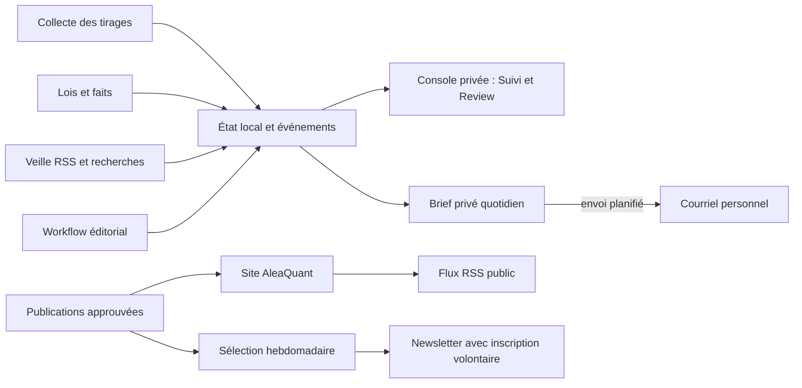

# Architecture éditoriale du site — maquette locale v0.7

Date : 2 octobre 2026 · Auteur : AleaQuant · Statut : **proposition MVP à valider ; maquette sous /maquette/, accueil non remplacé**
Historique : v0.7 distingue le pilotage privé quotidien, le RSS public et la
newsletter hebdomadaire ; v0.6 évalue chaque exemple de la maquette selon synopsis, notions,
complexité et intérêt éditorial ; v0.5 propose une homepage plus courte et trie les
contenus existants par utilité et maturité ; v0.4 précise l'application éditoriale responsive et le
parcours de publication avec choix de rubrique ; v0.3 ajoutait l'archive tabulaire
résultats + faits et alignait les histogrammes des fiches sur l'accueil.
TODO : faire valider l'évaluation éditoriale et la proposition MVP, puis cadrer
l'archive tabulaire après le rendu Keno à la demande.

## Décision : le prochain chantier

Le prochain sujet à développer est **le gabarit éditorial de l’accueil et des rubriques,
alimenté par des contenus approuvés**. La maquette locale est dans
`prototypes/editorial-home/index.html`. Elle montre la hiérarchie et les cartes ;
Sa copie est consultable sur [le Worker](https://aleaquant.aleaquant.workers.dev/maquette/) ;
elle ne remplace pas encore l’accueil du Worker. Le raccordement aux données réelles
et le choix d’un éventuel portage Astro viennent après validation visuelle et éditoriale.

## Carte du site proposée

| Rubrique | Question du lecteur | Contenus | Destination actuelle |
|---|---|---|---|
| Tirages | Que montre ce résultat ? | Fiche par tirage, analyse, article approuvé | `/tirages/` puis jeu et identifiant/date |
| Comprendre | Que signifie cette mesure ? | Explication, expérience, brève pédagogique | Mini-expérience et dictionnaire de l’accueil actuel |
| Atlas & géométries | Quelle forme ont les tirages et les portefeuilles ? | Atlas, visualisation, article de fond | Aperçu hétérogène ; contrat et cohortes dans `ATLAS-GEOMETRIES-ARCHITECTURE.md` |
| Recherche & méthode | Comment le sait-on ? | Note de recherche, veille, méthode, limites | Méthode actuelle ; notes à qualifier |

Le **Journal** est un fil transversal de publications approuvées, pas une cinquième
rubrique concurrençant les quatre parcours. Le sélecteur de jeu, le calendrier et
les archives restent dans « Tirages ». Une page de tirage garde son URL stable et
peut accueillir un article approuvé sans que l’article remplace les faits calculés.

## Gabarit commun

```text
Accueil
├─ promesse et illustration AleaQuant
├─ derniers tirages (données fraîches, par jeu)
├─ rubriques
│  ├─ introduction : nom, question, courte description, lien vers l’archive
│  └─ cartes de contenu : 1 contenu phare + 1 ou 2 contenus secondaires
└─ rappel de méthode

Carte : type · jeu/discipline · date → titre → chapô → visuel → lien/statut
Page de tirage : résultat → article approuvé éventuel → faits et mini-histogrammes
               → historique comparable → méthode/provenance → navigation
```

## Proposition de contenu pour la homepage MVP — à valider

La maquette actuelle présente huit cartes dans quatre grandes rubriques, en plus
du hero, des deux derniers tirages et du rappel méthodologique. Elle est cohérente
comme inventaire du projet, mais longue pour une première visite : elle montre des
contenus préparés comme s'ils étaient déjà une partie du magazine, et répète le même
parcours sur toute la page. Pour le MVP, l'accueil doit faire comprendre en quelques
écrans ce que fait AleaQuant, montrer que le site est vivant, puis donner trois portes
d'entrée. Les sujets non publiés restent dans la feuille de route éditoriale, pas dans
des cartes de homepage.

Ordre proposé :

1. **En-tête compact** : logo et liens Tirages, Comprendre, Atlas, Méthode. Le Journal
   reste un fil transversal des publications approuvées, pas une cinquième rubrique.
2. **Hero court** : garder « Le hasard a des structures. Explorons-les. », une phrase
   de promesse et l'illustration originale. Un seul appel à l'action, vers les derniers
   tirages. Garder « Comprendre le hasard n'est pas prédire le prochain tirage » comme
   principe visible, sans en répéter un long développement dès le hero.
3. **Derniers tirages** : conserver une carte par jeu dont la page est réellement
   consultable. Pour le MVP, EuroMillions et Loto ; ajouter Keno quand sa route de
   consultation et ses faits sont prêts. Chaque carte porte jeu, date, résultat,
   accroche descriptive et lien vers la fiche. Le titre de la fiche nomme toujours
   jeu et date, même si ces éléments figurent aussi dans les métadonnées.
4. **Un article à la une** : une seule carte large vers un contenu réellement publié,
   avec une illustration si elle sert l'explication. Au lancement, l'article historique
   EuroMillions du 6 septembre 2011 peut remplir ce rôle : c'est une preuve concrète
   qu'AleaQuant sait transformer des faits en récit. Il faut annoncer clairement sa
   date plutôt que le faire passer pour une actualité.
5. **Trois portes éditoriales** : une carte simple pour Comprendre, une pour Atlas,
   une pour Méthode. Une carte ne montre qu'un contenu publié et une promesse précise ;
   si la rubrique n'a pas encore de destination fonctionnelle, ne pas afficher de
   carte factice « à préparer ».
6. **Pied de page méthodologique bref** : une phrase sur les limites et un lien vers
   la page Méthode complète. Éviter de redire le manifeste entier.

### Grille d'évaluation des exemples existants

Les notes ne prétendent pas mesurer le goût du public. Elles rendent le tri
reproductible à partir de trois critères éditoriaux séparés : **complexité de
production** (1 = faits déjà disponibles et une notion simple ; 3 = données ou
méthodes nouvelles et plusieurs notions liées), **intérêt AleaQuant** (1 = faible
spécificité ; 5 = question forte au croisement hasard, mesure et combinatoire) et
**maturité MVP** (prêt, reformulable avec matière existante, ou à reporter). La liste
des notions indique ce qu'il faudrait expliquer dans la publication, pas nécessairement
de créer une page dictionnaire distincte.

| Exemple actuel | Synopsis de ce que le contenu devrait réellement raconter | Notions à définir ou distinguer | Complexité | Intérêt AleaQuant | Évaluation et destination |
|---|---|---|---:|---:|---|
| « Une grille qui traverse quatre dizaines » — EuroMillions, 29/09/2026 | Lire la répartition des cinq numéros par dizaines comme une petite carte de position ; opposer ce constat descriptif à toute prétention de prédiction. | Tirage/grille ; dizaine occupée ; position sur l'échelle vs dispersion ; règle et résultat datés. | 1 | 4/5 | Bon rendez-vous de homepage si les faits et la page sont à jour. Garder l'accroche, ajouter jeu et date au titre complet ; préférer « dizaines » ou définir « décade ». |
| « Deux numéros dans la décade 5 » — Loto, 28/09/2026 | Décrire deux numéros dans la cinquième tranche de dix et situer séparément les trois autres ; conduire vers la fiche du Loto. | « Décade » au sens de tranche de dix ; répartition par dizaine ; différence entre résultat Loto et EuroMillions ; numéro Chance. | 1 | 4/5 | Bon contenu d'actualité, mais le chapô doit exposer clairement le constat et ne pas présumer que le lectorat connaît « décade 5 ». |
| « Une somme à 222, tout en haut de la grille » — EuroMillions, 06/09/2011 | Partir de la somme 222 et demander combien de grilles complètes partagent cette somme, puis comparer la classe à la probabilité d'une grille exacte. | Somme ; classe de métrique ; grille exacte ; fréquence de classe vs queue ; régime historique 5/50 et étoiles de l'époque. | 2 | 5/5 | Bon article repère pour montrer profondeur et méthode, mais le titre actuel confond somme et position. Reformuler en question sur ce que « 222 » mesure ; annoncer qu'il s'agit d'un tirage historique. |
| « Une chance égale, des sommes inégales » — expérience exhaustive | Dans un petit univers calculable à la main, toutes les paires ont même probabilité, alors que certaines sommes sont obtenues par plus de paires que d'autres. | Événement élémentaire ; équiprobabilité ; somme ; classe dérivée ; énumération exhaustive. | 1 | 5/5 | Priorité éditoriale MVP : contraste net, explication courte, expérience déjà présente sur le site actuel. Vérifier que le lien de la carte cible encore cette expérience. |
| « Pourquoi une grille rare n'est pas une grille chanceuse » | Montrer qu'une classe rare pour une métrique donnée ne rend pas la combinaison exacte plus probable et n'améliore pas sa chance au prochain tirage. | Rareté d'une classe ; probabilité d'une grille exacte ; observation vs prédiction ; tirages indépendants sous le modèle déclaré. | 2 | 5/5 | Bonne idée de lancement, titre à resserrer pour éviter de personnifier la grille : « Une classe rare ne rend pas une grille plus probable ». À publier seulement avec un exemple vérifié et les deux probabilités bien distinguées. |
| « Des motifs dans le bruit ? » — aperçu de l'Atlas | Formuler une question nulle concrète sur les paires : combien sont observées, combien sont attendues sous le modèle choisi, et quelle référence rend la comparaison lisible ? | Cooccurrence ; paire distincte ; fréquence observée/attendue ; modèle nul ; historique et régime. | 2 | 5/5 | Intérêt élevé mais titre sensationnaliste et objet trop vague. Reformuler « Paires observées : que prévoit le modèle uniforme ? » ; relier uniquement si l'Atlas montre source, population et référence. |
| « Une géométrie de grilles, à budget égal » — portefeuilles | Comparer plusieurs portefeuilles ayant le même nombre de grilles, selon une famille explicitée de mesures de couverture et de recouvrement ; ne pas confondre géométrie et probabilité marginale d'une grille. | Portefeuille ; budget ; couverture des numéros/paires ; recouvrement entre grilles ; référence RANDOM ; critères d'équilibre. | 3 | 5/5 | Sujet fort pour l'Atlas, mais prématuré pour la homepage tant que familles, paramètres et exemples qualifiés ne sont pas décidés. Reporter au lancement de l'Atlas. |
| « Ce que mesure AleaQuant » — méthode | Expliquer les frontières entre calcul exhaustif, loi d'une métrique, historique, simulation et interprétation, puis rappeler que ces outils ne prédisent pas le prochain tirage. | Exact/exhaustif ; simulation ; probabilité de grille vs métrique ; observation historique ; interprétation. | 2 | 5/5 | Contenu de référence à conserver et rendre facilement accessible. Sur la homepage, un lien et une phrase suffisent ; le détail reste dans la page Méthode. |
| « Covariance des positions : une piste d'audit » | Introduire la matrice reliant le plus petit numéro, le deuxième, etc., puis auditer sa relation avec l'étendue selon chaque jeu et régime avant toute interprétation. | Covariance ; ordre statistique ; matrice ; covariance théorique vs historique ; régime ; étendue. | 3 | 4/5 | Important pour le programme de recherche, trop spécialisé et encore en qualification pour la homepage MVP. Garder au manifeste éditorial et revenir après l'audit. |

Blocs non publiés qui servent de cadre plutôt que de cartes : le hero « Le hasard a
des structures » est une promesse adéquate si l'illustration reste clairement
illustrative ; le rappel constitutionnel est juste mais le texte long actuel répète
le hero et la page Méthode. Pour le MVP, conserver une seule phrase près du hero et un
lien vers les détails méthodologiques.

À garder hors de la homepage MVP, mais dans le programme éditorial : Benjamini–
Hochberg et la multiplicité des métriques ; recouvrements de grilles, paires,
triplets et rangs ; analogie prudente avec les t-spreads ; pyramide des rangs et
redistribution ; loteries « k parmi C » dans le monde ; calcul HPC en combinatoire.
Ce sont des sujets de fond dont certains nécessitent encore un dossier de preuves,
une définition de métrique ou des sources par jeu/régime. Ils pourront alimenter le
Journal au fil de leur validation, sans devenir des promesses de rubrique avant d'être
publiables.

Cette proposition ne décide pas encore du nombre définitif de cartes par écran ni
du design Astro. Ces choix restent soumis à une revue mobile et à la disponibilité
réelle des destinations.

Une carte n'est publiée que si son objet cible existe et est publiable. Les sujets
prévus dans la maquette portent explicitement « à préparer » et n'ont pas de lien.
Le type est explicite : `article`, `analyse_tirage`, `breve`, `experience`,
`note_recherche` ou `reference`. Une future entrée de manifeste devrait porter
au minimum : `id`, `type`, `rubrique`, `titre`, `chapo`, `date`, `url`, `statut`,
`jeu` facultatif, `visuel` et son texte alternatif, et références de provenance.
Pour un article, l'URL et le titre viennent de la version humaine approuvée, liée
aux empreintes du brouillon et du Research Pack. Pour une analyse de tirage, le jeu,
la règle et le résultat viennent des faits calculés. Ne pas recopier manuellement
des chiffres dans une carte produite automatiquement.

Les cartes ont une structure HTML/CSS commune. Le visuel peut être une illustration
originale, un SVG descriptif calculé ou une texture, mais jamais un graphique qui
suggère une mesure absente. Le libellé « très rare » se rapporte toujours à une
classe de métrique définie, jamais au tirage dans son ensemble.

## Mini-histogrammes sur les pages de tirage

Le rendu statique des fiches doit insérer les mini-histogrammes à partir de la loi
exacte du **même régime** que le tirage. Le trait orange situe la valeur observée ;
la carte conserve la fréquence et la rareté de la **classe exacte**. Pour rester
cohérent avec la homepage, chaque classe est dessinée dans sa propre barre, sans
regroupement. Sur les lois longues, les barres deviennent simplement plus étroites ;
la loi, les effectifs et la rareté de classe ne sont pas agrégés. Les lois catégorielles
et les métriques dépourvues de loi n'ont pas de mini-histogramme ; leur carte textuelle
reste visible.

Depuis la correction locale du 30 septembre, chaque métrique scalaire dont la loi
est disponible pour le bon régime peut recevoir ce repère ; le Loto
`LO-20260928` en affiche 18. Les signatures non ordonnées restent textuelles.
La vérification de régime doit précéder le rendu ; une loi absente ou
discordante conduit à omettre le graphe, pas à afficher un dessin trompeur.

## Frontières d'architecture

- `aleaquant-data` fournit les tirages et révisions ; le moteur local produit les
  lois et les faits. Aucun LLM ne modifie ces nombres.
- `aleaquant-editorial-agents` organise propositions, preuves, rédaction, contrôles
  et approbation humaine. Le batch existant du site reste une voie distincte tant
  que son intégration n'est pas qualifiée.
- `aleaquant-web` construit les pages et les index statiques. Le Worker Cloudflare
  sert les artefacts après une décision de publication ; Wrangler n'est pas un CMS.
- `prototypes/editorial-home/` sert aux essais visuels locaux. Aucune carte de
  brouillon ne doit y être présentée comme article déjà publié.

## Diffusion publique et pilotage privé — cible de roadmap

Trois produits doivent rester distincts :

1. **RSS public AleaQuant** : index machine des seuls articles et brèves publiés,
   sans compte ni données personnelles.
2. **Newsletter hebdomadaire** : sélection éditoriale distincte du flux exhaustif,
   envoyée uniquement aux personnes inscrites et munie d'un lien de désinscription.
   Le prestataire, la conservation des adresses et l'archive des numéros sont à
   choisir avant réalisation.
3. **Suivi privé et brief quotidien du comité** : dans la console protégée, une vue
   « Suivi » expose l'état des pipelines et de la chaîne de publication ; un résumé
   personnel quotidien renvoie vers les détails et les validations en attente. Il
   ne s'agit pas d'une newsletter publique.

La vue privée regroupe par jeu la dernière récupération, le dernier tirage connu,
le retard estimé, les étapes résultats → lois/faits → pages → déploiement et les
erreurs récentes. Elle montre aussi la fraîcheur des flux RSS de veille, les
recherches réalisées (requêtes, sources et coût API lorsqu'il est mesurable), et les
volumes d'articles à chaque étape : proposition, veille, preuves, rédaction,
révision, bloqué, prêt pour validation, approuvé et publié. Les chiffres sont
accompagnés de leur fenêtre temporelle et d'un état « données indisponibles » quand
une intégration n'a pas répondu ; une donnée absente ne devient jamais un zéro.

Pour la fréquentation, distinguer l'audience de pages et la télémétrie du Worker.
Cloudflare Web Analytics fournit notamment visites, pages vues et performance ; les
métriques Workers obtenues par GraphQL portent sur les requêtes, erreurs et temps
d'exécution. Ce ne sont pas des mesures interchangeables. Une intégration API doit
utiliser un jeton en lecture seule conservé dans l'environnement local, jamais dans
le site statique ni dans le navigateur. Au premier jalon, les liens vers les tableaux
de bord Cloudflare peuvent suffire ; l'agrégation automatique et l'envoi d'un brief
par courriel viennent ensuite.

Références Cloudflare consultées le 2 octobre 2026 : [mesures Web Analytics](https://developers.cloudflare.com/web-analytics/data-metrics/high-level-metrics/), [métriques Workers et Analytics GraphQL](https://developers.cloudflare.com/workers/observability/metrics-and-analytics/) et [jeton Analytics en lecture seule](https://developers.cloudflare.com/analytics/graphql-api/getting-started/authentication/api-token-auth/).

Le digest quotidien est un agrégat déterministe des journaux et états disponibles,
pas un article généré par LLM. Il met en avant les changements depuis le précédent
brief, les travaux terminés, les blocages/retards et les approbations attendues. Il
doit être idempotent, daté, consultable dans la console et tolérer les sources
indisponibles. Il est envoyé chaque matin à une adresse personnelle configurée ; le
prestataire est à choisir avant réalisation. Une panne d'envoi est visible dans la
console et permet une relance sans duplicata. Le courriel contient un lien protégé
par Cloudflare Access ; aucun brouillon complet ni secret n'est inclus dans le
message. Comme les états principaux résident sur le Mac, le cadrage doit décider
comment traiter une machine endormie : générer le brief au prochain réveil avec une
mention de sa période, ou exporter un agrégat minimal vers un composant planifié
Cloudflare. Cette seconde option ne doit pas exposer SQLite, les brouillons, les
preuves privées ni les secrets.



## Documents de suivi

Les fonctions et priorités sont dans [`ROADMAP.md`](ROADMAP.md). Les travaux
d'ingénierie et validations techniques sont dans [`TECHNICAL-DEBT.md`](TECHNICAL-DEBT.md).
Les comparaisons qui doivent déboucher sur un choix sont suivies dans
[`TASKS.md`](TASKS.md). Les sujets éditoriaux restent au comité du dépôt
`aleaquant-editorial-agents`. Cette note conserve le gabarit cible, les rubriques,
les conventions de rendu et les frontières de données ; elle n'est pas une todolist.

Ni cette maquette ni les mini-histogrammes ne changent la chaîne d'approbation,
les faits ou le sens des probabilités. Comprendre le hasard n'est pas prédire le
prochain tirage.

## Traçabilité des tirages — décision du 2 octobre 2026

Le contrat [Sources et méthode](ARTICLE-TRACEABILITY.md) ajoute une projection
publique déterministe dans le draft approuvé : note courte et preuves dépliables.
Le batch/direct et la review LangGraph partagent les mêmes gardes. La prose reste
distincte du registre. Aucun article existant n'est approuvé ou republié par migration.

### Préférence de présentation des notes — 2 octobre 2026

Prévoir une police distincte à empattements, légèrement plus petite que le corps,
avec contraste suffisant. Réserver l'italique au court rappel méthodologique ;
sources et chiffres restent droits. Préférence enregistrée, CSS non modifié dans
le lot de recalcul des faits.

## Console privée commune — cadrage du 2 octobre 2026

L’administration des batchs partage l’outil et l’accès privé de Review ; elle ne
constitue pas un second site ni un CMS public. Onglets cibles : Suivi, Tirages &
calculs, Lots & agents, Review, Publication, Système ; journal commun des exécutions.
Le [contrat canonique](../../aleaquant-editorial-agents/docs/ADMIN-CONSOLE-ARCHITECTURE.md)
définit les tâches, frontières, validations et lots. Cette navigation est à réaliser.
